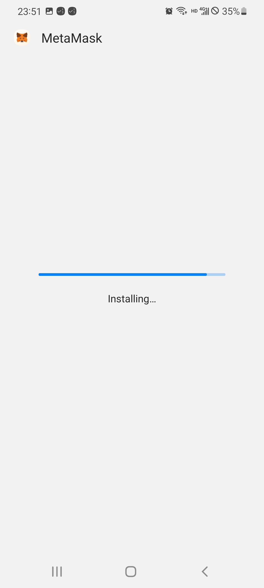
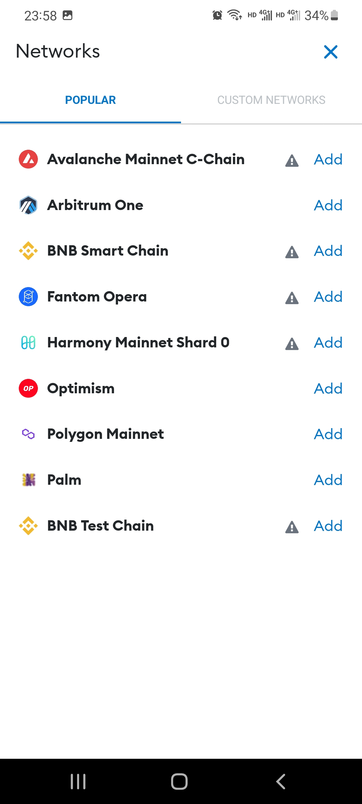
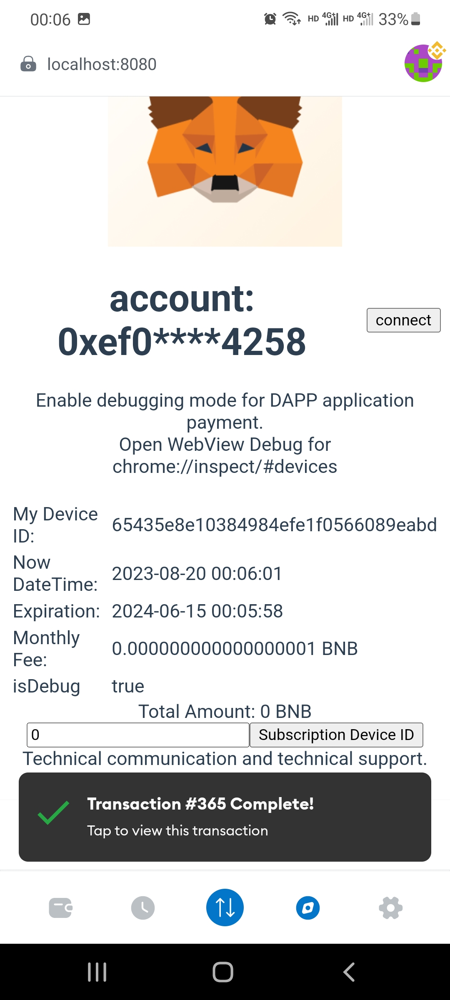

# MetaMaskDebug
[EN README](README.md)
MetaMask 移动钱包启用了 WebView 调试模式，允许使用 Google Chrome 直接调试 DAPP。

此外，基于官方源码，我们做出以下承诺：我们不会收集用户的私密数据，如私钥或助记词，也没有后门。修改这个钱包的主要目的是为了我们自己的使用，并为加密行业应用的兼容性测试提供便利。作为收入来源，用户将需要为 Dapp 调试付费。

这个应用程序基于官方源码进行了轻微的修改，具体修改如下。

MetaMask 移动版 Android 版本号为 v7.3.0。
支持两个主要功能：

1. HTTPS DApps 不验证证书，方便开发者在本地网络中调试 DApps（免费）。

2. WebView 的 DEBUG 模式已解锁，支持使用 "Chrome 开发者工具" 源代码调试 DApps（需付费）。

请下载我们的最新应用程序版本以进行安装。由于文件稍大，请使用下载管理器（如迅雷或 BitTorrent）协助下载。下载链接如下：
https://github.com/bitkanda/MetaMaskDebug/releases

安装指南：
1. 安装界面。
 

 
2. 安装中。
 

 
3. 欢迎界面。
 

 
4. 钱包界面。
 

 
5. 添加 BNB 智能链网络。
 

 
6. 找到 BNB 智能链并点击“添加”。
 

 
7. 点击“Approve”。
 

 
8. 新的网络已添加。是否切换到此网络？点击“切换到网络”。
 

 
9. 打开钱包 Dapp 浏览器，提示连接到账号。点击“连接”。
 

 
10. 在这里，您可以选择授权连接多个账号。
 

 
11. 切换网络后，您需要点击“...”菜单，然后选择“刷新”以刷新当前页面。
 

 
12. 刷新后，您应该能够看到您的账户、支付网关和付款信息。
 

 
13. 在输入框中，输入“1”以订购 1 个月。然后点击“Subscription Device ID”。
显示每月订阅费，点击“确认”。请注意，此费用随时可能更改。
 

 
14. 付款成功后，将自动刷新到期时间。
 

 
15. 要通过 USB 将手机连接到计算机，请打开 Chrome 浏览器，输入“chrome://inspect/#devices”以访问调试入口和可调试的 DAPP。
 

 
16. 您可以输入您在 VUE 或其他 DAPP 中开发的应用程序的地址，无论是在公共互联网上还是在相同的局域网上，以进行调试和查看错误信息。这些信息对于调试和故障排除非常有用。
 

 
如果您有任何进一步的问题，请访问 https://github.com/bitkanda/MetaMaskDebug/issues 提交。谢谢，祝大家编码愉快！