# MetaMaskDebug

[中文版 README](README-cn.md)

MetaMask mobile wallet enables WebView debugging mode, allowing direct debugging of DAPP using Google Chrome.

In addition, based on the official source code, we make the following commitments: We will not collect user's private data, such as private keys or mnemonic phrases, and there are no backdoors. The primary purpose of modifying this wallet is for our own use and to facilitate compatibility testing with applications in the cryptocurrency industry. As a source of revenue, users will be charged for debugging Dapps.

This application has undergone minor modifications based on the official source code, with the following changes.

The version number of MetaMask mobile for Android is v7.3.0.
Two main functionalities are supported:

1.HTTPS DApps do not validate certificates, making it convenient for developers to debug DApps within the local network--free.

2.WebView's DEBUG mode is unlocked, facilitating source code debugging of DApps using "inspect with chrome developer tools" - available for a fee.

Please download our latest version of the application for installation. The file is a bit large, so please use a download manager for assistance, such as Thunder or BitTorrent. The download link is as follows:
https://github.com/bitkanda/MetaMaskDebug/releases

Installation Guide:
1.Installation Interface.
 
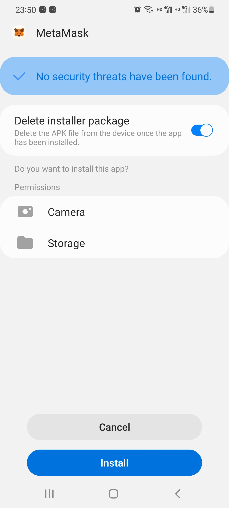
 
2.Installation in progress.
 
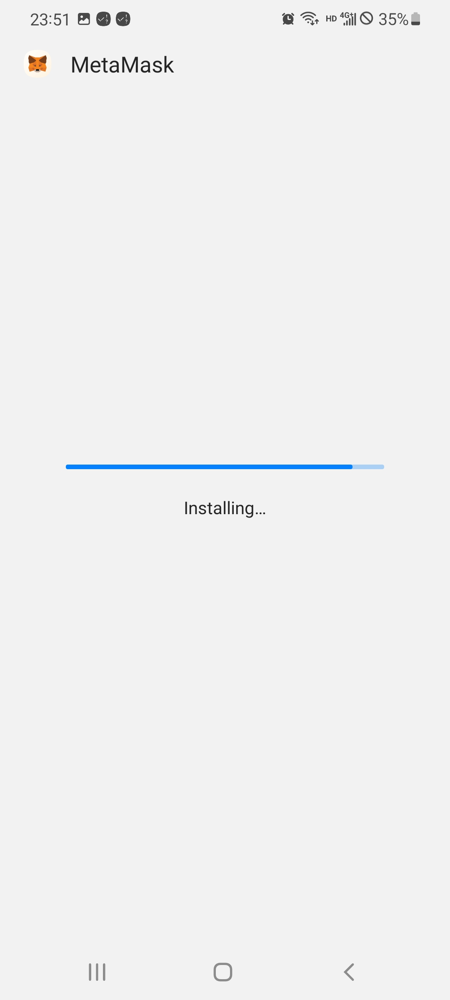
 
3.Welcome Screen.
 
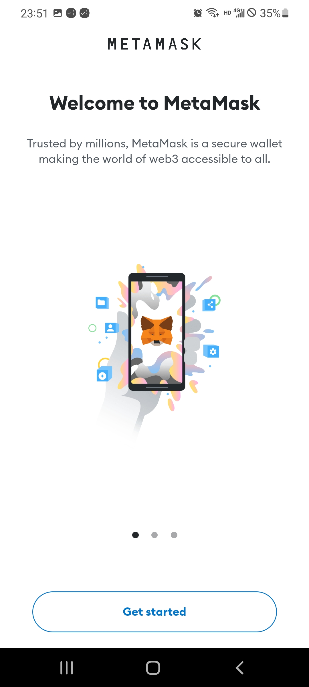
 
4.Wallet Interface.
 

 
5.Add BNB Smart Chain Network.
 
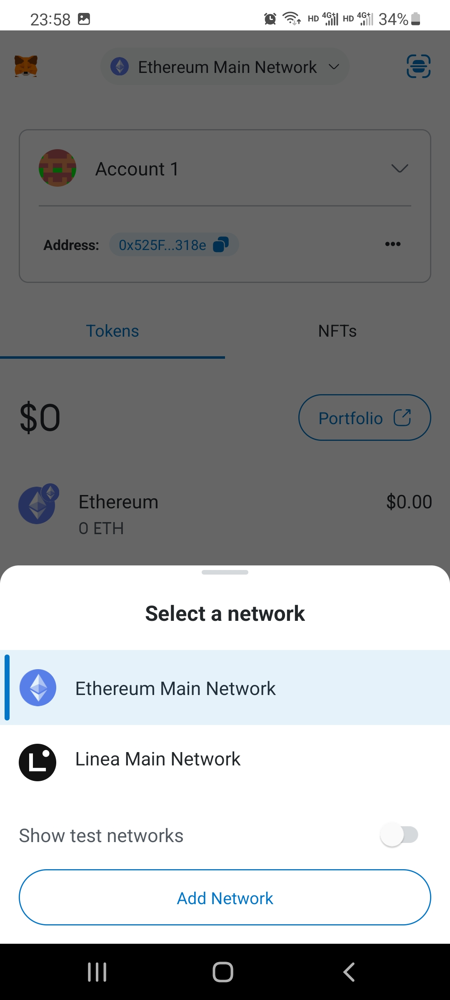
 
6.Locate BNB Smart Chain and click 'Add'.
 
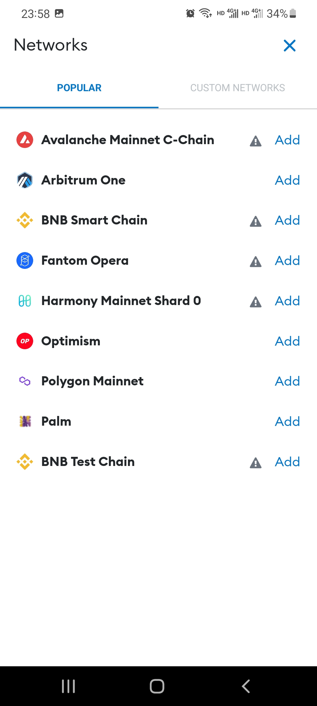
 
7.Click 'Approve'.
 
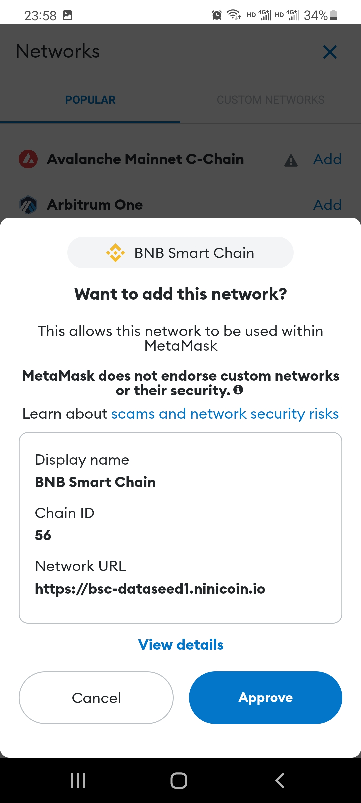
 
8.The new network has been added. Do you want to switch to this network? Click 'Switch to network'.
 
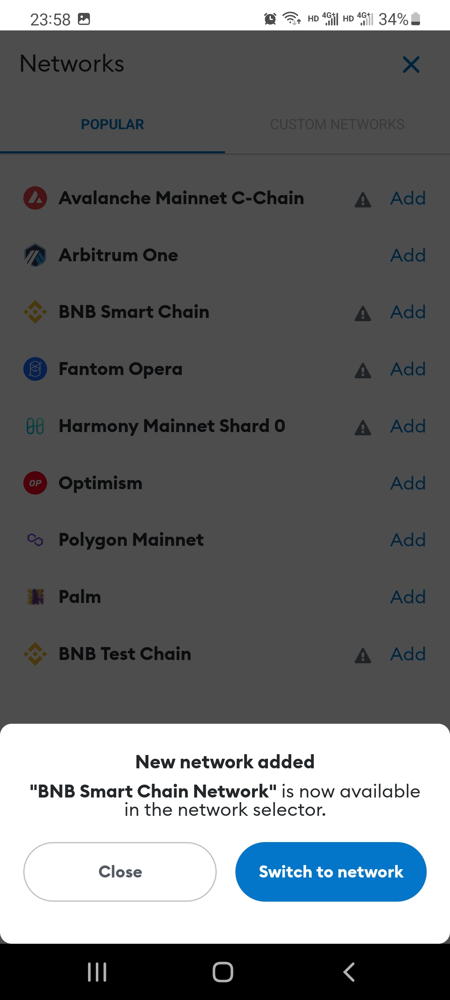
 
9.Open the wallet Dapp browser, it prompts to connect to an account. Click 'Connect'.
 

 
10.Here, you can choose to authorize the connection of multiple accounts.
 
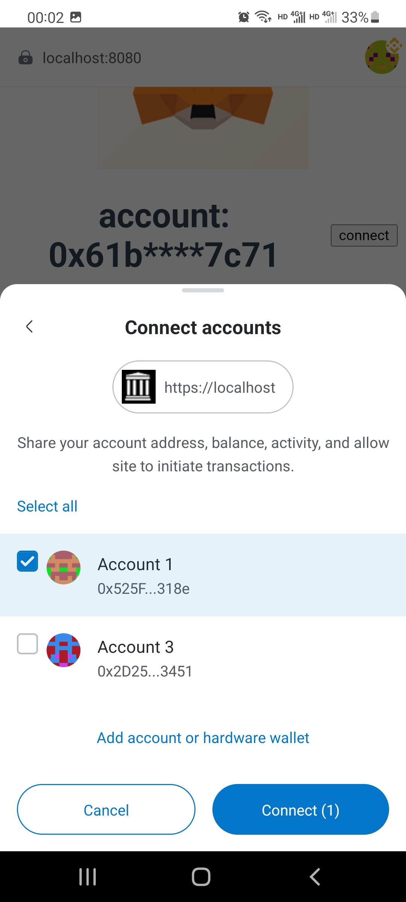
 
11.After switching networks, you need to click on the '...' menu and then select 'Reload' to refresh the current page.
 
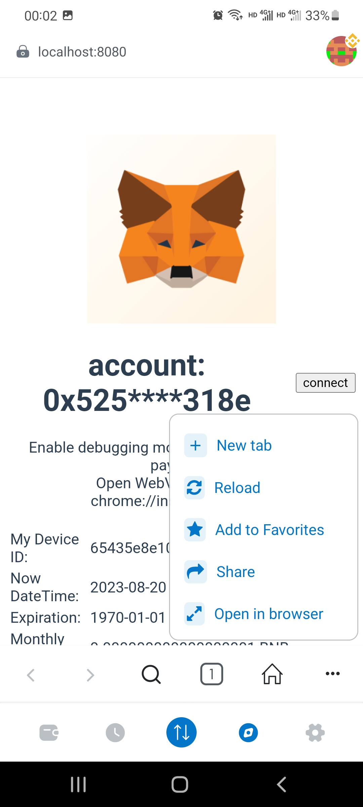
 
12.After refreshing, you should be able to see your account, the payment gateway, and payment information.
 
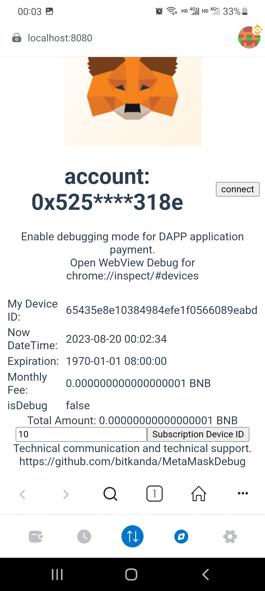
 
13.In the input box, enter '1' to subscribe for 1 month. Then click on 'Subscription Device ID'.
Displaying the monthly subscription fee, click 'Confirm.' Please note that this fee is subject to change at any time.
 
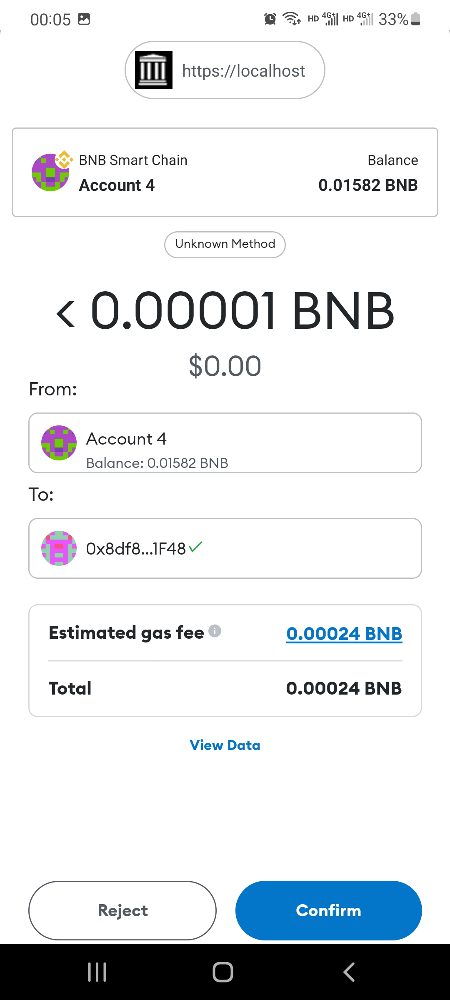
 
14.After a successful payment, it will automatically refresh the expiration date.
 
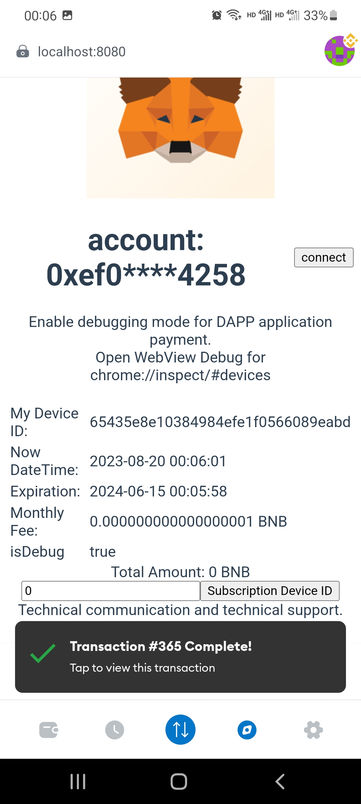
 
15.To connect your phone to your computer via USB, open the Chrome browser and enter 'chrome://inspect/#devices' to access the debugging entry and the DAPP that can be debugged.
 
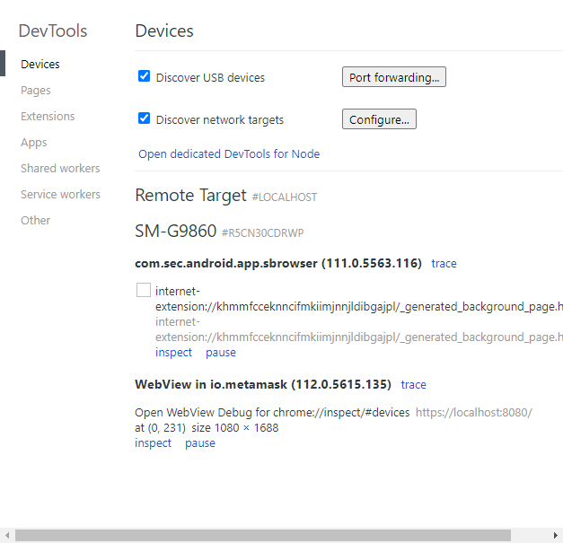
 
16.You can enter the address of your application developed in VUE or another DAPP, whether it's on the public internet or on the same local network, to debug and view error messages. These pieces of information are extremely useful for debugging and troubleshooting.
 
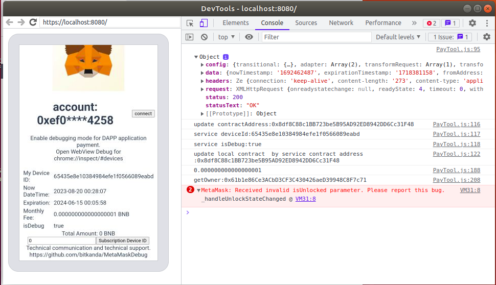
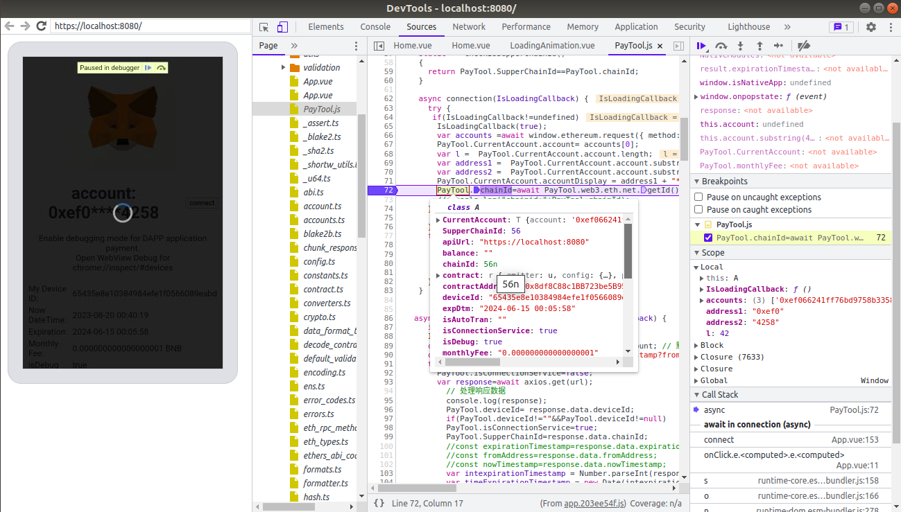
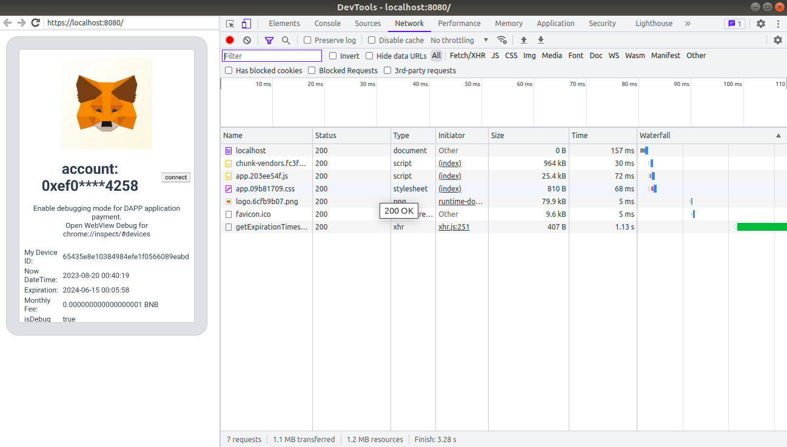
 
If you have any further questions, please visit https://github.com/bitkanda/MetaMaskDebug/issues to submit them. Thank you, and happy coding to everyone!

