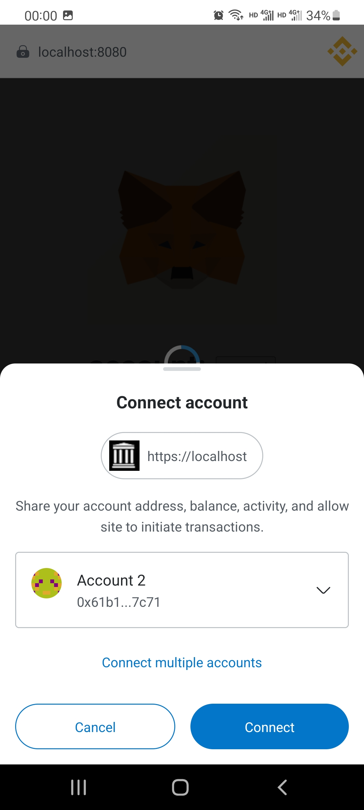

# MetaMaskDebug
MetaMask mobile wallet enables WebView debugging mode, allowing direct debugging of DAPP using Google Chrome.

The version number of MetaMask mobile for Android is v6.5.0.
Two main functionalities are supported:

1.HTTPS DApps do not validate certificates, making it convenient for developers to debug DApps within the local network--free.

2.WebView's DEBUG mode is unlocked, facilitating source code debugging of DApps using "inspect with chrome developer tools" - available for a fee.

